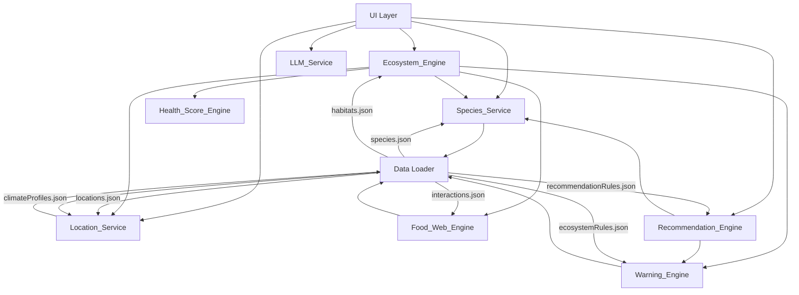
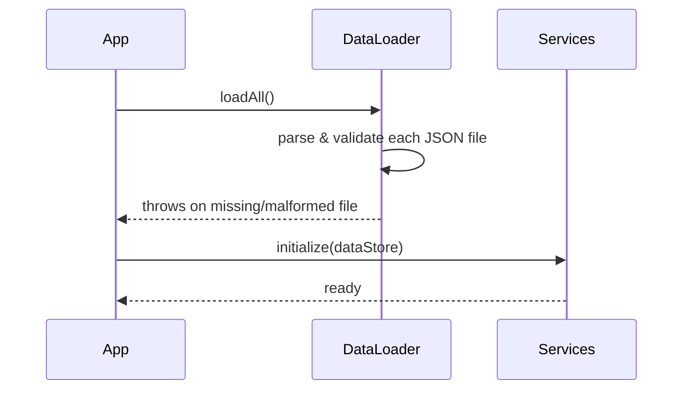

# Design Document: Ecosystem Builder Backend

## Overview

The Ecosystem Builder Backend is a pure JavaScript service layer that provides all ecological intelligence for a desktop-first React application. It operates entirely in-process — no server, no network calls (except the optional LLM provider), no database. All data is loaded from JSON files at initialization and held in memory for the lifetime of the application session.

The backend is organized as a set of independent service modules, each with a single responsibility. Modules communicate through plain JavaScript objects; there is no shared mutable state between modules. The UI layer calls service functions directly and receives structured result objects in return.

### Design Goals

- **Correctness over cleverness**: ecological rules are encoded explicitly in data files, not inferred by algorithms.
- **Predictability**: every function is pure or near-pure — given the same inputs, it returns the same outputs.
- **Composability**: engines are independent and can be called in any order; the Ecosystem_Engine acts as the coordinator that feeds other engines.
- **Fail-fast initialization**: data file problems surface at startup, not during user interaction.
- **Provider-agnostic LLM**: the LLM abstraction layer can be swapped without touching any calling code.

### Out of Scope (v1)

- Persistence / save-and-load of ecosystem sessions
- User accounts or authentication
- Server-side rendering or API endpoints
- Real-time collaboration
- Streaming LLM responses

---

## Architecture

### Module Dependency Graph



### Initialization Sequence



All JSON files are loaded once at application startup via a single `DataLoader` module. Each service module receives the pre-validated data store at initialization time. If any file fails validation, an error is thrown before any service is initialized.

### Project Structure

```
food-chain/
  data/
    species.json
    locations.json
    interactions.json
    ecosystemRules.json
    habitats.json
    climateProfiles.json
    recommendationRules.json
  services/
    dataLoader.js          # loads, parses, validates all JSON files
    speciesService.js      # species catalog queries and filtering
    locationService.js     # city → climate profile + native species
    ecosystemEngine.js     # session state management + coordination
    foodWebEngine.js       # trophic graph and relationship modeling
    warningEngine.js       # rule evaluation and warning emission
    healthScoreEngine.js   # numeric health score computation
    recommendationEngine.js # species suggestion ranking
    llmService.js          # LLM provider abstraction
  utils/
    resultFactory.js       # ok() / err() result object helpers
    validators.js          # shared field-presence validators
  index.js                 # public API surface — re-exports all services
```

---

## Components and Interfaces

### Result Object Contract

Every public service function returns a result object. No service throws for expected error conditions.

```js
// Success
{ success: true, data: <payload> }

// Failure
{ success: false, error: { message: string, code: string } }
```

Helper factory (`resultFactory.js`):

```js
export const ok = (data) => ({ success: true, data });
export const err = (message, code) => ({ success: false, error: { message, code } });
```

Error codes are `SCREAMING_SNAKE_CASE` strings (e.g., `SPECIES_NOT_FOUND`, `CITY_NOT_FOUND`, `INVALID_PROJECT_MODE`).

---

### Species_Service (`speciesService.js`)

Holds the in-memory species catalog and exposes query/filter functions.

```js
// Initialization
speciesService.initialize(speciesArray)

// Queries — all return { success, data } where data is Species[] or Species
speciesService.getAll()
speciesService.getById(id)                          // → Species | NOT_FOUND error
speciesService.filterByKingdom(kingdomCategory)
speciesService.filterByHabitat(habitatType)
speciesService.filterByClimate(climateProfile)
speciesService.filterByProjectMode(mode)            // 'outdoor' | 'terrarium' | 'aquarium'
speciesService.filterByNativeRegion(regionId)
speciesService.filter(criteria)                     // multi-criteria AND filter
```

`filter(criteria)` accepts an object with any combination of `{ kingdom, habitat, climate, mode, region }` keys and applies all provided filters as an AND conjunction.

---

### Location_Service (`locationService.js`)

Resolves city names and biome identifiers to climate profiles and native species lists.

```js
// Initialization
locationService.initialize(locationsArray, climateProfilesArray)

// Queries
locationService.resolveCity(cityName)
// → { climateProfile, regionId, nativeSpeciesIds }

locationService.resolveByBiome(biomeId)
// → ClimateProfile

locationService.getRegionId(cityName)
// → string regionId
```

City name matching is case-insensitive and trims whitespace. If no match is found, returns `err('City not found', 'CITY_NOT_FOUND')`.

---

### Ecosystem_Engine (`ecosystemEngine.js`)

Manages a single ecosystem session. The session object is a plain JavaScript object passed by reference; the engine returns a new session object on each mutation (immutable update pattern).

```js
// Session creation
ecosystemEngine.createSession({ mode, cityName? })
// → { success, data: EcosystemSession }

// Species management
ecosystemEngine.addSpecies(session, speciesId)
// → { success, data: EcosystemSession }

ecosystemEngine.removeSpecies(session, speciesId)
// → { success, data: EcosystemSession }

// Derived views
ecosystemEngine.getFullSpeciesList(session)
// → Species[]  (pre-existing + user-placed, deduplicated)

// Evaluation triggers (delegate to sub-engines)
ecosystemEngine.evaluate(session)
// → { foodWeb, warnings, healthScore }
```

**EcosystemSession shape:**

```js
{
  mode: 'outdoor' | 'terrarium' | 'aquarium',
  location: LocationResolution | null,   // null for terrarium/aquarium
  preExistingSpeciesIds: string[],       // populated for outdoor mode
  placedSpeciesIds: string[],            // user additions
  climateProfile: ClimateProfile | null
}
```

---

### Food_Web_Engine (`foodWebEngine.js`)

Computes the trophic graph from a species list and interaction records.

```js
// Initialization
foodWebEngine.initialize(interactionsArray)

// Computation
foodWebEngine.compute(speciesList)
// → { success, data: FoodWebResult }
```

**FoodWebResult shape:**

```js
{
  trophicLevels: { [level: number]: Species[] },
  predatorPreyPairs: Array<{ predator: Species, prey: Species }>,
  pollinationLinks: Array<{ pollinator: Species, dependent: Species }>,
  competitionPairs: Array<{ speciesA: Species, speciesB: Species }>,
  symbioticPairs: Array<{ speciesA: Species, speciesB: Species, type: string }>,
  trophicRatios: Array<{ fromLevel: number, toLevel: number, ratio: number }>,
  hasProducer: boolean,
  hasDecomposer: boolean,
  gaps: string[]   // human-readable gap descriptions
}
```

---

### Warning_Engine (`warningEngine.js`)

Evaluates all applicable rules against the current ecosystem state and emits structured warnings.

```js
// Initialization
warningEngine.initialize(rulesArray)

// Evaluation
warningEngine.evaluate({ speciesList, foodWeb, climateProfile, mode, regionId })
// → { success, data: Warning[] }
```

**Warning shape:**

```js
{
  ruleId: string,
  severity: 'critical' | 'major' | 'minor',
  message: string,
  affectedSpeciesIds: string[]
}
```

Warnings are returned sorted by severity: `critical` first, then `major`, then `minor`.

---

### Health_Score_Engine (`healthScoreEngine.js`)

Computes a 0–100 health score from the ecosystem state.

```js
// Computation
healthScoreEngine.compute({ speciesList, foodWeb, warnings, mode, climateProfile, regionId })
// → { success, data: HealthScoreResult }
```

**HealthScoreResult shape:**

```js
{
  score: number,          // 0–100
  label: string,          // 'unstable' | 'developing' | 'healthy' | 'highly resilient'
  breakdown: {
    [dimensionName: string]: {
      rawScore: number,   // 0–100 for this dimension
      weight: number,     // fractional weight applied
      contribution: number // rawScore * weight
    }
  }
}
```

---

### Recommendation_Engine (`recommendationEngine.js`)

Generates ranked species recommendations for the current ecosystem.

```js
// Initialization
recommendationEngine.initialize(recommendationRulesArray)

// Recommendations
recommendationEngine.recommend({ session, speciesList, warnings, foodWeb })
// → { success, data: Recommendation[] }
```

**Recommendation shape:**

```js
{
  species: Species,
  reasonCode: 'fills-gap' | 'native-match' | 'similar-species' | 'improves-balance',
  reasonDetail: string,
  score: number   // internal ranking score, higher = more relevant
}
```

---

### LLM_Service (`llmService.js`)

Provider-agnostic abstraction for plain-language content generation.

```js
// Configuration
llmService.configure({ provider: 'openai' | 'anthropic' | 'mock', apiKey?, options? })

// Content requests
llmService.explainWarning({ warning, affectedSpecies, ecosystemContext })
// → { success, data: string }

llmService.summarizeSpecies(speciesRecord)
// → { success, data: string }

llmService.narrateRecommendation({ recommendation, ecosystemContext })
// → { success, data: string }
```

The `mock` provider returns deterministic placeholder strings and is used for testing and offline development. All provider implementations must satisfy the same interface contract.

---

## Data Models

### species.json

Top-level structure: an array of Species Records.

```json
[
  {
    "id": "string (unique, kebab-case)",
    "commonName": "string",
    "scientificName": "string",
    "kingdomCategory": "plants | mammals | birds | reptiles | amphibians | fish | insects | fungi | decomposers",
    "trophicLevel": "number (1–5)",
    "supportedProjectModes": ["outdoor", "terrarium", "aquarium"],
    "habitats": ["string"],
    "climateNeeds": {
      "minTemp": "number (°C)",
      "maxTemp": "number (°C)",
      "minPrecipitation": "number (mm/yr)",
      "maxPrecipitation": "number (mm/yr)",
      "minHumidity": "number (0–100)",
      "maxHumidity": "number (0–100)",
      "biomes": ["string"]
    },
    "nativeRegions": ["string"],
    "invasiveRegions": ["string"],
    "ecosystemRoles": ["producer", "consumer", "decomposer", "pollinator", "predator", "prey"],
    "predators": ["speciesId"],
    "prey": ["speciesId"],
    "conflictsWith": ["speciesId"],
    "dependencies": ["speciesId"],
    "similarSpecies": ["speciesId"],
    "nearbySpecies": ["speciesId"],
    "maxDensityHint": "number | null",
    "careNotes": "string"
  }
]
```

Required fields (validated at load): `id`, `commonName`, `scientificName`, `kingdomCategory`, `trophicLevel`, `supportedProjectModes`, `habitats`, `climateNeeds`.

---

### locations.json

Top-level structure: an array of Location Records.

```json
[
  {
    "id": "string (unique)",
    "cityName": "string",
    "countryCode": "string (ISO 3166-1 alpha-2)",
    "regionId": "string",
    "biomeId": "string",
    "nativeSpeciesIds": ["speciesId"],
    "aliases": ["string"]
  }
]
```

`aliases` allows alternate city name spellings to resolve to the same record.

---

### climateProfiles.json

Top-level structure: an array of Climate Profile Records, keyed by biome.

```json
[
  {
    "id": "string (biomeId)",
    "biomeName": "string",
    "tempRangeMin": "number (°C)",
    "tempRangeMax": "number (°C)",
    "precipRangeMin": "number (mm/yr)",
    "precipRangeMax": "number (mm/yr)",
    "humidityRangeMin": "number (0–100)",
    "humidityRangeMax": "number (0–100)"
  }
]
```

---

### interactions.json

Top-level structure: an array of Interaction Records.

```json
[
  {
    "id": "string (unique)",
    "sourceSpeciesId": "speciesId",
    "targetSpeciesId": "speciesId",
    "relationshipType": "predation | competition | symbiosis | mutualism | parasitism | pollination",
    "directionality": "unidirectional | bidirectional",
    "notes": "string"
  }
]
```

Required fields: `sourceSpeciesId`, `targetSpeciesId`, `relationshipType`.

---

### ecosystemRules.json

Top-level structure: an array of Rule Records.

```json
[
  {
    "id": "string (unique)",
    "type": "string (rule category, e.g. 'trophic-imbalance', 'invasive-species', 'habitat-mismatch')",
    "severity": "critical | major | minor",
    "message": "string (template, may contain {speciesName} placeholders)",
    "appliesTo": "outdoor | terrarium | aquarium | all",
    "conditions": {
      "trophicRatioThreshold": "number | null",
      "requiresProducer": "boolean | null",
      "requiresDecomposer": "boolean | null"
    }
  }
]
```

Required fields: `id`, `type`, `severity`, `message`, `appliesTo`.

---

### habitats.json

Top-level structure: an array of Habitat Records.

```json
[
  {
    "id": "string (unique)",
    "name": "string",
    "compatibleBiomes": ["biomeId"],
    "projectModes": ["outdoor", "terrarium", "aquarium"]
  }
]
```

---

### recommendationRules.json

Top-level structure: an array of Recommendation Rule Records.

```json
[
  {
    "id": "string (unique)",
    "reasonCode": "fills-gap | native-match | similar-species | improves-balance",
    "priority": "number (higher = ranked first)",
    "description": "string"
  }
]
```

---

## Health Score Computation Algorithm

The health score is computed as a weighted sum of dimension scores. Each dimension produces a raw score from 0 to 100, which is multiplied by its weight. The weights sum to 1.0.

### Dimension Weights

| Dimension | Weight | Notes |
|---|---|---|
| Producer Sufficiency | 0.15 | Whether ≥1 producer (trophic level 1) is present |
| Prey/Predator Balance | 0.15 | Trophic ratio quality across all level transitions |
| Biodiversity | 0.10 | Spread of species across kingdom categories |
| Pollination Support | 0.08 | Pollinator presence relative to pollinator-dependent species |
| Habitat Compatibility | 0.10 | Fraction of species whose habitats match the ecosystem habitat |
| Climate/Location Suitability | 0.10 | Fraction of species whose climateNeeds overlap the resolved climate profile |
| Invasive Species Penalty | 0.08 | Penalty per invasive species in outdoor mode; 100 for non-outdoor |
| Resource Competition Penalty | 0.06 | Penalty proportional to competition pair density |
| Decomposer Presence | 0.08 | Binary: 100 if ≥1 decomposer present, 0 otherwise |
| Aquatic/Terrestrial Fit | 0.05 | Mode-specific: aquatic-fit for aquarium, terrestrial-fit for terrarium/outdoor |
| Dependency Satisfaction | 0.05 | Fraction of species whose dependencies are all present |

**Mode adjustments:**
- For `aquarium` mode: the terrestrial-fit sub-dimension is excluded; its weight is redistributed proportionally to the remaining dimensions.
- For `terrarium` mode: the aquatic-fit sub-dimension is excluded; its weight is redistributed proportionally.
- For `outdoor` mode: both sub-dimensions are evaluated and averaged into the Aquatic/Terrestrial Fit dimension.

### Dimension Score Formulas

**Producer Sufficiency**: `hasProducer ? 100 : 0`

**Prey/Predator Balance**: For each trophic level transition, compute `ratio = min(preyCount, predatorCount) / max(preyCount, predatorCount)`. Average all ratios × 100. If no transitions exist, score = 50 (neutral).

**Biodiversity**: `(uniqueKingdomCategories / totalKingdomCategories) × 100`

**Pollination Support**: `pollinatorDependentCount === 0 ? 100 : (pollinatorsPresent ? 100 : 0)`

**Habitat Compatibility**: `(compatibleSpeciesCount / totalSpeciesCount) × 100`

**Climate/Location Suitability**: `(climateSuitableCount / totalSpeciesCount) × 100`

**Invasive Species Penalty**: `mode !== 'outdoor' ? 100 : max(0, 100 - (invasiveCount × 20))`

**Resource Competition Penalty**: `max(0, 100 - (competitionPairCount × 10))`

**Decomposer Presence**: `hasDecomposer ? 100 : 0`

**Dependency Satisfaction**: `(satisfiedDependencyCount / totalDependencyCount) × 100` (100 if no dependencies)

### Health Label Thresholds

| Score Range | Label |
|---|---|
| 0–39 | `unstable` |
| 40–59 | `developing` |
| 60–79 | `healthy` |
| 80–100 | `highly resilient` |

---

## Warning Evaluation Pipeline

The Warning_Engine processes rules in a defined pipeline order. Each stage is independent and emits zero or more warnings.

```
Input: { speciesList, foodWeb, climateProfile, mode, regionId }

Stage 1: Missing Foundational Species
  - No producer present → critical warning (ecosystem-level)
  - No decomposer present → major warning (ecosystem-level)
  - No pollinator but pollinator-dependent species present → major warning

Stage 2: Per-Species Compatibility Checks
  For each species in speciesList:
    - Habitat mismatch → minor warning
    - Climate incompatibility → minor warning
    - Invasive in resolved region (outdoor mode only) → major warning

Stage 3: Inter-Species Conflict Checks
  For each species pair:
    - conflictsWith match → major warning (both species cited)
    - Missing dependency → minor warning (dependent species cited)

Stage 4: Trophic Balance Checks
  For each trophic level transition in foodWeb:
    - ratio > threshold from applicable rule → major warning

Stage 5: Density Checks
  For each species with maxDensityHint:
    - count in placed collection > maxDensityHint → minor warning

Output: Warning[] sorted by severity (critical → major → minor)
```

Rule Records from `ecosystemRules.json` are matched to pipeline stages by their `type` field. The `appliesTo` field filters rules to the current project mode.

---

## Food Web Computation Approach

The food web is computed in a single pass over the species list and interaction records.

### Algorithm

1. **Trophic assignment**: Group species by `trophicLevel` field. Build a map `{ level → Species[] }`.

2. **Predator-prey identification**: For each species S, check `S.prey` — for each prey ID in that list, if the prey species is present in the ecosystem, emit a predator-prey pair `(S, prey)`. Also check `S.predators` for reverse direction.

3. **Interaction record scan**: For each Interaction Record where both `sourceSpeciesId` and `targetSpeciesId` are present in the ecosystem:
   - `predation` → add to predatorPreyPairs (if not already captured by step 2)
   - `competition` → add to competitionPairs
   - `symbiosis` / `mutualism` → add to symbioticPairs
   - `pollination` → add to pollinationLinks

4. **Trophic ratio computation**: For each adjacent level pair `(L, L+1)`, compute:
   ```
   ratio = speciesAtLevel(L+1).length / max(1, speciesAtLevel(L).length)
   ```
   A ratio > 1.0 means more predators than prey at that transition (imbalanced).

5. **Gap detection**:
   - `hasProducer = trophicLevels[1]?.length > 0`
   - `hasDecomposer = speciesList.some(s => s.ecosystemRoles.includes('decomposer'))`

6. **Return** the assembled `FoodWebResult` object.

---

## Recommendation Ranking Logic

The Recommendation_Engine builds a candidate pool and ranks it by a composite score.

### Candidate Pool Construction

1. Start with all species from the catalog.
2. Remove species already in `session.placedSpeciesIds` or `session.preExistingSpeciesIds`.
3. Remove species whose `conflictsWith` list intersects the current full species list.
4. Filter to species compatible with the current `mode`, `habitat`, and `climateProfile`.

### Scoring

Each candidate receives a score based on matched reason codes:

| Reason Code | Base Score | Condition |
|---|---|---|
| `fills-gap` | 40 | Species fills a gap flagged by Warning_Engine (missing producer, decomposer, or pollinator) |
| `native-match` | 30 | Species `nativeRegions` includes the resolved `regionId` (outdoor mode only) |
| `similar-species` | 20 | Species ID appears in `similarSpecies` or `nearbySpecies` of a placed species |
| `improves-balance` | 10 | Species would reduce a trophic imbalance (adds to under-represented trophic level) |

A candidate may accumulate multiple reason codes; scores are summed. Candidates with score = 0 are excluded from results.

### Output

Candidates are sorted descending by score. Each result carries the highest-priority `reasonCode` (by base score) and a `reasonDetail` string derived from the matched condition.

---

## Data Loading and Validation Layer

The `DataLoader` module is the single entry point for all JSON data. It is called once at application startup.

```js
// dataLoader.js
export async function loadAll(dataDir) {
  const files = [
    'species.json',
    'locations.json',
    'interactions.json',
    'ecosystemRules.json',
    'habitats.json',
    'climateProfiles.json',
    'recommendationRules.json'
  ];

  const store = {};
  for (const file of files) {
    store[file] = await loadAndValidate(dataDir, file);
  }
  return store;
}
```

### Validation Rules

Each file has a required-fields validator:

| File | Required top-level structure | Per-record required fields |
|---|---|---|
| `species.json` | Array | `id`, `commonName`, `scientificName`, `kingdomCategory`, `trophicLevel`, `supportedProjectModes`, `habitats`, `climateNeeds` |
| `locations.json` | Array | `id`, `cityName`, `regionId`, `biomeId` |
| `interactions.json` | Array | `sourceSpeciesId`, `targetSpeciesId`, `relationshipType` |
| `ecosystemRules.json` | Array | `id`, `type`, `severity`, `message`, `appliesTo` |
| `habitats.json` | Array | `id`, `name` |
| `climateProfiles.json` | Array | `id`, `biomeName` |
| `recommendationRules.json` | Array | `id`, `reasonCode`, `priority` |

### Deduplication

After loading `species.json`, the DataLoader deduplicates by `id`. If duplicates are found, a `console.warn` is emitted identifying the duplicate IDs, and the first occurrence is retained.

### Error Behavior

- Missing file → throws `DataLoadError: File not found: {filename}`
- Unparseable JSON → throws `DataLoadError: Invalid JSON in {filename}: {parseError}`
- Missing required field → throws `DataLoadError: Missing required field '{field}' in {filename} record at index {i}`

---

## Error Handling

### Expected vs. Unexpected Errors

| Error Type | Handling |
|---|---|
| Data file missing/malformed | Throw at initialization — application cannot start |
| City not found | Return `err('City not found', 'CITY_NOT_FOUND')` |
| Species ID not found | Return `err('Species not found', 'SPECIES_NOT_FOUND')` |
| Invalid project mode | Return `err('Invalid project mode', 'INVALID_PROJECT_MODE')` |
| Species already in session | Return `err('Species already placed', 'SPECIES_ALREADY_PLACED')` |
| Location-dependent op without location | Return `err('No location resolved', 'NO_LOCATION_RESOLVED')` |
| LLM provider error | Return `err(providerMessage, 'LLM_PROVIDER_ERROR')` |
| LLM provider unavailable | Return `err('LLM provider unavailable', 'LLM_UNAVAILABLE')` |

### No Silent Failures

All service functions either return a result object or throw (only for programming errors, not user-input errors). The UI layer checks `result.success` before accessing `result.data`.

---

## Testing Strategy

### Dual Testing Approach

Unit tests cover specific examples, edge cases, and error conditions. Property-based tests verify universal properties across all inputs. Both are necessary for comprehensive coverage.

### Property-Based Testing

This feature is well-suited for property-based testing. The core engines are pure functions over structured data, with clear input/output contracts and universal properties that hold across all valid inputs. The recommended PBT library is **fast-check** (JavaScript).

Each property test runs a minimum of 100 iterations. Tests are tagged with:
```
// Feature: ecosystem-builder-backend, Property N: <property text>
```

### Unit Testing

Unit tests focus on:
- Specific filter combinations in Species_Service
- City name resolution edge cases (case-insensitivity, aliases)
- Session mutation correctness (add/remove species)
- Warning emission for each rule type with concrete examples
- Health score label boundary values (39/40, 59/60, 79/80)
- LLM_Service mock provider behavior
- DataLoader error messages for each failure mode

### Integration Testing

Integration tests verify:
- Full `ecosystemEngine.evaluate()` pipeline with a realistic species set
- DataLoader loading all seven files from disk
- LLM_Service with a real provider (skipped in CI, run manually)


---

## Correctness Properties

*A property is a characteristic or behavior that should hold true across all valid executions of a system — essentially, a formal statement about what the system should do. Properties serve as the bridge between human-readable specifications and machine-verifiable correctness guarantees.*

### Property 1: Species Filter Correctness

*For any* array of species records and any single filter criterion (kingdom, habitat, project mode, or native region), filtering by that criterion returns exactly the species that satisfy it — no false positives (species that don't match) and no false negatives (matching species that are excluded).

**Validates: Requirements 1.2, 1.3, 1.5, 1.6**

---

### Property 2: Multi-Criteria Filter Conjunction

*For any* array of species records and any combination of filter criteria, the result of `filter(criteria)` equals the intersection of applying each individual criterion filter separately.

**Validates: Requirements 1.7**

---

### Property 3: Species Lookup Round-Trip

*For any* species array, looking up a species by its `id` returns that exact species record; looking up an ID not present in the array returns a structured not-found error (not a thrown exception).

**Validates: Requirements 1.8**

---

### Property 4: Climate Compatibility Filter

*For any* array of species records and any climate profile, filtering by climate returns exactly the species whose `climateNeeds` ranges overlap the profile's temperature, precipitation, and humidity ranges.

**Validates: Requirements 1.4**

---

### Property 5: City Resolution Completeness

*For any* location record in the data store, resolving the city name returns a result containing a climate profile with all required fields (biome, temperature range, precipitation range, humidity range), the native species IDs, and the geographic region identifier — all matching the source location record.

**Validates: Requirements 2.1, 2.2, 2.3**

---

### Property 6: Unknown City Returns Structured Error

*For any* string that does not match any city name or alias in the locations data, `resolveCity` returns `{ success: false, error: { code: 'CITY_NOT_FOUND' } }` without throwing an exception.

**Validates: Requirements 2.4**

---

### Property 7: Biome Direct Lookup

*For any* climate profile record in the data store, `resolveByBiome(id)` returns that climate profile.

**Validates: Requirements 2.6**

---

### Property 8: Session Initialization Shape

*For any* valid project mode and optional location, `createSession` returns a session with the correct mode, an empty `placedSpeciesIds` array, and (for outdoor mode) a `preExistingSpeciesIds` array populated from the resolved location's native species list.

**Validates: Requirements 3.1**

---

### Property 9: Species Add/Remove Round-Trip

*For any* ecosystem session and any valid species ID not already placed, adding that species and then removing it returns a session whose `placedSpeciesIds` is identical to the original. Conversely, for any session with at least one placed species, removing a species results in a session where that ID is no longer present and the list length decreased by one.

**Validates: Requirements 3.2, 3.3**

---

### Property 10: Full Species List Is Union of Pre-Existing and Placed

*For any* ecosystem session, `getFullSpeciesList` returns a list that contains every species ID in `preExistingSpeciesIds` and every species ID in `placedSpeciesIds`, with no duplicates.

**Validates: Requirements 3.4, 3.8, 10.4**

---

### Property 11: Mode Compatibility Invariant

*For any* curated session (terrarium or aquarium), every species in `getFullSpeciesList` has the session's mode in its `supportedProjectModes` array.

**Validates: Requirements 3.5, 3.6**

---

### Property 12: Invalid Species Add Returns Error Without Mutation

*For any* ecosystem session and any species ID not present in the species catalog, `addSpecies` returns `{ success: false }` and the session's `placedSpeciesIds` is unchanged.

**Validates: Requirements 3.7**

---

### Property 13: Trophic Level Assignment Completeness

*For any* species list, `foodWebEngine.compute` assigns every species to its declared `trophicLevel` in the `trophicLevels` map — no species is missing from the map, and no species appears at a level other than its declared one.

**Validates: Requirements 4.1**

---

### Property 14: Predator-Prey and Relationship Detection

*For any* species list and interaction records, the computed food web contains every predator-prey pair, competition pair, symbiotic pair, and pollination link where both species are present in the ecosystem — and contains no pairs where either species is absent.

**Validates: Requirements 4.2, 4.3, 4.4, 4.5**

---

### Property 15: Trophic Ratio Computation

*For any* species list, the trophic ratio at each level transition `(L → L+1)` equals `count(level L+1) / max(1, count(level L))`.

**Validates: Requirements 4.6**

---

### Property 16: Gap Detection Flags

*For any* species list, `hasProducer` is `true` if and only if at least one species has `trophicLevel === 1`, and `hasDecomposer` is `true` if and only if at least one species has `'decomposer'` in its `ecosystemRoles`.

**Validates: Requirements 4.7, 4.8**

---

### Property 17: Warning Structural Completeness

*For any* ecosystem state that triggers at least one warning, every emitted warning contains a non-empty `ruleId` string, a `severity` value in `{ 'critical', 'major', 'minor' }`, a non-empty `message` string, and an `affectedSpeciesIds` array.

**Validates: Requirements 5.2**

---

### Property 18: Invasive Species Warning Coverage

*For any* outdoor ecosystem containing N species whose `invasiveRegions` includes the resolved `regionId`, the warnings array contains exactly N invasive-species warnings — one per invasive species.

**Validates: Requirements 5.3**

---

### Property 19: Per-Species Compatibility Warnings

*For any* ecosystem state, every species whose `habitats` array does not include the ecosystem's resolved habitat type produces a habitat-mismatch warning, and every species whose `climateNeeds` ranges do not overlap the resolved climate profile produces a climate-incompatibility warning.

**Validates: Requirements 5.5, 5.6**

---

### Property 20: Missing Foundational Species Warnings

*For any* ecosystem with no trophic level 1 species, the warnings array contains a missing-producer warning. *For any* ecosystem with pollinator-dependent species and no pollinator species, the warnings array contains a missing-pollinator warning.

**Validates: Requirements 5.7, 5.11**

---

### Property 21: Conflict and Dependency Warnings

*For any* ecosystem where species A's `conflictsWith` includes species B's ID and both are placed, the warnings array contains a coexistence-conflict warning citing both species. *For any* species whose `dependencies` list includes an ID not present in the ecosystem, the warnings array contains a missing-dependency warning for that species.

**Validates: Requirements 5.8, 5.9**

---

### Property 22: Warning Severity Ordering

*For any* ecosystem state producing multiple warnings of different severities, the warnings array is sorted such that all `critical` warnings precede all `major` warnings, which precede all `minor` warnings.

**Validates: Requirements 5.12**

---

### Property 23: Health Score Range Invariant

*For any* ecosystem state (including empty ecosystems, all-invasive ecosystems, and maximally conflicted ecosystems), the computed health score is always in the closed interval `[0, 100]`.

**Validates: Requirements 6.1**

---

### Property 24: Health Label Determinism

*For any* score value in `[0, 100]`, the health label is exactly determined by the threshold rules: score < 40 → `'unstable'`, 40 ≤ score < 60 → `'developing'`, 60 ≤ score < 80 → `'healthy'`, 80 ≤ score ≤ 100 → `'highly resilient'`.

**Validates: Requirements 6.3**

---

### Property 25: Health Score Breakdown Completeness

*For any* ecosystem state, the `breakdown` object contains an entry for every applicable dimension, and each entry has a `rawScore` in `[0, 100]`, a `weight` in `(0, 1]`, and a `contribution` equal to `rawScore × weight`. The sum of all `contribution` values equals the total `score`.

**Validates: Requirements 6.2, 6.4**

---

### Property 26: Invasive Species Penalty Monotonicity

*For any* outdoor ecosystem, adding an additional invasive species (one whose `invasiveRegions` includes the resolved region) does not increase the invasive-species dimension's `rawScore`.

**Validates: Requirements 6.5**

---

### Property 27: Decomposer Absence Zeroes Dimension

*For any* ecosystem with no species having `'decomposer'` in `ecosystemRoles`, the `decomposerPresence` dimension's `rawScore` is exactly 0.

**Validates: Requirements 6.6**

---

### Property 28: Recommendation Exclusion Invariants

*For any* ecosystem state, no recommended species ID appears in `placedSpeciesIds` or `preExistingSpeciesIds`, and no recommended species has a `conflictsWith` entry that matches any species in the full species list.

**Validates: Requirements 7.5, 7.6**

---

### Property 29: Recommendation Compatibility

*For any* ecosystem state, every recommended species has the current project mode in its `supportedProjectModes` and has `climateNeeds` compatible with the resolved climate profile.

**Validates: Requirements 7.1**

---

### Property 30: Gap-Filling Recommendations

*For any* ecosystem state where the Warning_Engine has emitted a missing-producer, missing-decomposer, or missing-pollinator warning, the recommendations array includes at least one species with `reasonCode: 'fills-gap'` that addresses that specific gap.

**Validates: Requirements 7.2**

---

### Property 31: Similar/Nearby Species Inclusion

*For any* placed species with `similarSpecies` or `nearbySpecies` IDs that are not already in the ecosystem and do not conflict with any placed species, those species appear in the recommendations.

**Validates: Requirements 7.3**

---

### Property 32: Recommendation Reason Code Validity

*For any* ecosystem state producing recommendations, every recommendation has a `reasonCode` value in `{ 'fills-gap', 'native-match', 'similar-species', 'improves-balance' }`.

**Validates: Requirements 7.7**

---

### Property 33: LLM Provider Error Returns Structured Result

*For any* LLM service call when the configured provider returns an error or is unavailable, the result is `{ success: false, error: { code: 'LLM_PROVIDER_ERROR' | 'LLM_UNAVAILABLE', message: string } }` without throwing an exception.

**Validates: Requirements 8.5**

---

### Property 34: Data Validation Rejects Missing Required Fields

*For any* record in any data file that is missing a required field, `loadAll` throws a `DataLoadError` whose message identifies the missing field name and the source file.

**Validates: Requirements 9.1, 9.3, 9.4, 9.5**

---

### Property 35: Missing or Malformed File Throws Descriptive Error

*For any* file path that does not exist or contains invalid JSON, `loadAll` throws a `DataLoadError` whose message identifies the filename and the nature of the problem.

**Validates: Requirements 9.2**

---

### Property 36: Species Deduplication Retains First Occurrence

*For any* species array containing duplicate `id` values, after loading, each `id` appears exactly once in the resulting catalog, and the retained record is the first occurrence in the input array.

**Validates: Requirements 9.6**

---

### Property 37: Result Object Contract

*For any* service call that succeeds, the result satisfies `result.success === true` and `result.data !== undefined`. *For any* service call that fails with an expected error condition, the result satisfies `result.success === false`, `result.error.message` is a non-empty string, and `result.error.code` is a non-empty string — and no exception is thrown.

**Validates: Requirements 10.1, 10.2, 10.3**

---

### Property 38: Outdoor Session Without Location Rejects Location-Dependent Operations

*For any* outdoor session where no location has been resolved, calling any location-dependent operation (invasive species check, native species list retrieval, climate compatibility evaluation) returns `{ success: false, error: { code: 'NO_LOCATION_RESOLVED' } }` without throwing.

**Validates: Requirements 10.5**
